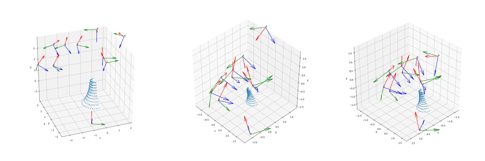
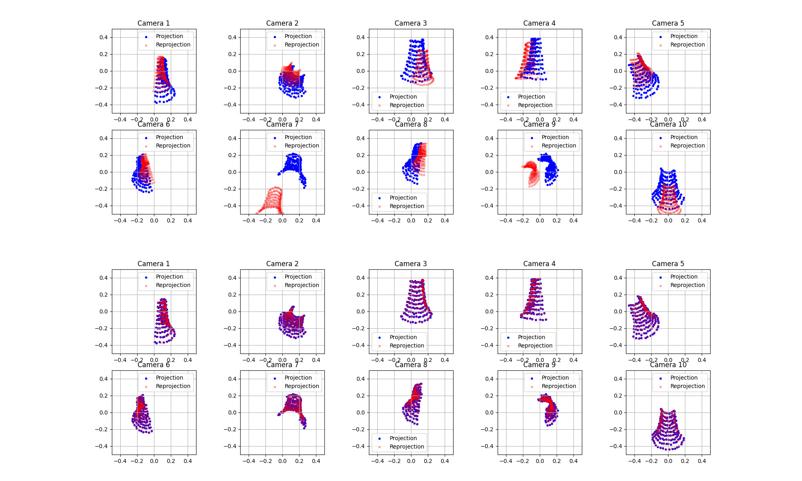

# 3D Reconstruction from Multi View

Experimental code for 3D reconstruction from multi images

## Methods

* Multi-View Factorization
* Euclidean Upgrading
* Bundle Adjustment

## Environment setting

```bash
pip install pipenv  # If pipenv is not installed
cd <repository root path>
pipenv sync
```

## Usage

```bash
pipenv run python euclidiean_reconstruction.py
```

## Result

### Reconstruction

The left image is the ground-truth. The middle image is the initial value estimated by the factorization method. The right image shows the initial values estimated by the factorization method and optimized by bundle adjustment.



### Reprojection

The image above is a reprojection of the initial values estimated by the factorization method. The lower image shows it optimized by bundle adjustment.



## Reference

* 金谷健一, 菅谷保之, 金澤靖. 3 次元コンピュータビジョン計算ハンドブック. 2016.
  * K. Kanatani, Y. Sugaya, and Y. Kanazawa, Guide to 3D Vision Computation: Geometric Analysis and Implementation, Springer International, Cham, Switzerland, December, 2016.
